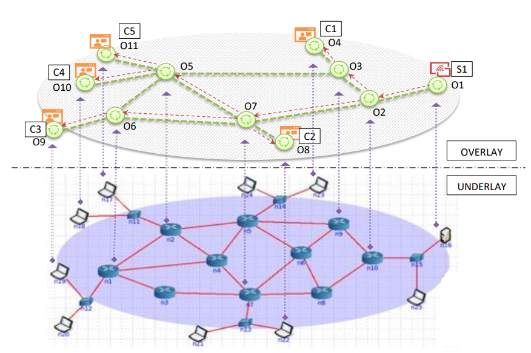
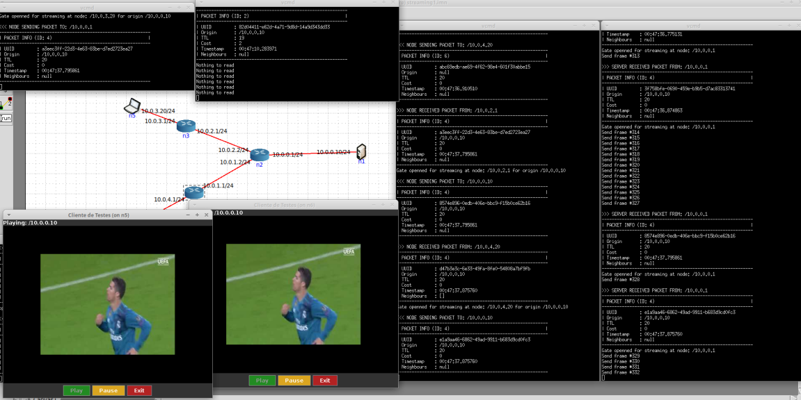
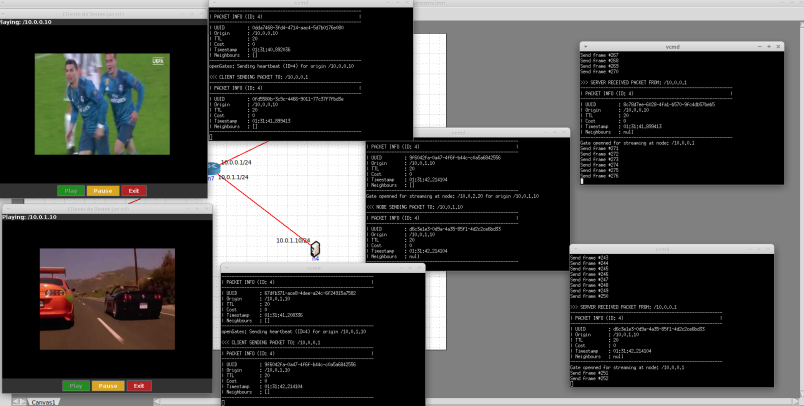
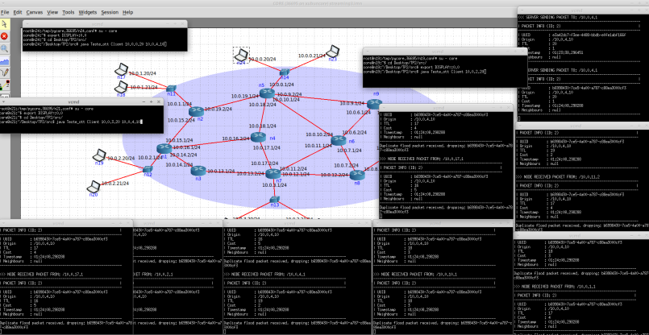
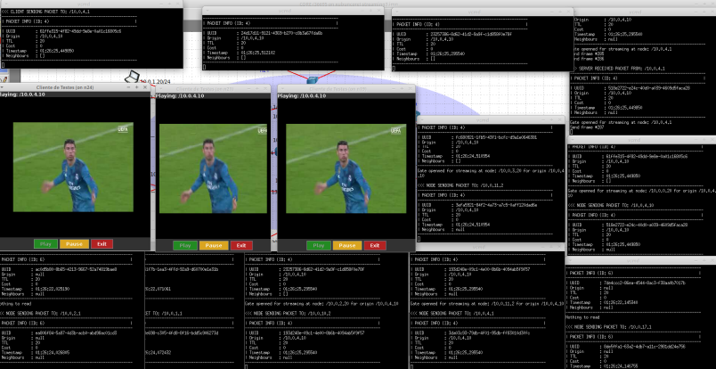

# Over-the-Top (OTT) Multimedia Delivery Service

> [!NOTE]
> This is a brief summary of the project. For detailed information, full architecture explanation, and performance analysis, please refer to the [**Project Report**](report.pdf).

## 📸 Screenshots

<p align="center">
  
  <br>
  <em>Figure 1: Overlay and Underlay network topology</em>
</p>

<p align="center">
  
  <br>
  <em>Figure 2: Simple topology with 2 clients</em>
</p>

<p align="center">
  
  <br>
  <em>Figure 3: Simple topology with 2 different streams</em>
</p>

<p align="center">
  
  <br>
  <em>Figure 4: Complex topology</em>
</p>

<p align="center">
  
  <br>
  <em>Figure 5: Complex topology with 3 clients</em>
</p>

## 📄 Context & Motivation

In the last half-century, the Internet has shifted from a simple end-to-end communication paradigm to the massive consumption of continuous multimedia content, often in real-time. Traditional client-server architectures face severe scalability issues; as the number of clients increases, the server and network struggle to support the streams without quality loss.

To address this, **Over-the-Top (OTT)** services (like Netflix or Hulu) operate on the application layer to deliver content. This project implements an **Application Layer Overlay Network** to distribute audio/video content efficiently, bypassing underlay network congestion and optimizing resource usage.

## 🎯 Objectives

The main goal is to design and prototype a service capable of delivering real-time multimedia from a server to multiple clients using an overlay network.

Key objectives include:

- **Scalability:** Implementing **Application Layer Multicast** so the server sends a single stream regardless of the number of clients.

- **Dynamic Routing:** Building and maintaining routing tables based on network metrics (latency and hop count).

- **Efficiency:** Ensuring data is only replicated to paths with active clients.

- **Resilience:** Handling dynamic node joins and client connection states.


## 🏗 System Architecture

The solution creates a logical **Overlay** network on top of a physical **Underlay** infrastructure (emulated using CORE).

### Key Components

1. **Server & Bootstrapper (`Server.java`)**
   - Acts as the multimedia source (reading MJPEG files) and the initial contact point (Bootstrapper).


   - Manages the topology by providing new nodes with a list of neighbors based on a configuration file.


2. **Overlay Node (`Node.java`)**
   - The fundamental element of the overlay, executed on intermediate machines.


   - Responsible for forwarding traffic, maintaining neighbor connections, and executing the routing protocol.


3. **Client (`Client.java`)**
   - The end-user application that requests entry into the session and reproduces the video stream.


   - Sends periodic "Keep-Alive" messages to keep the data flow active.


## 🚀 Features & Implementation Details

### 1. Dynamic Routing with Hybrid Metrics

Instead of relying solely on hop count, the routing protocol prioritizes **Latency (Delay)**.

- **Implementation:** The server initiates a "Flood" message containing a timestamp.

- **Logic:** When a node receives a flood message, it compares the new path against the existing one. It updates the route if the new path has lower latency, or equal latency with fewer hops.

- **Benefit:** Allows the system to choose faster routes even if they traverse more nodes.

### 2. Application-Layer Multicast (Smart Replication)

To solve the scalability problem, the system uses a reverse-path forwarding strategy controlled by explicit signaling.

- **Implementation:** Nodes maintain a "Routing Map" where neighbors are marked as `on` or `off`.

- **Logic:**
  - Clients send **"Open Gate"** () messages upstream.
  - Nodes only replicate RTP packets to neighbors specifically flagged as `on`.

  - If a client stops sending heartbeats (detected via timeouts), the node closes the gate and propagates the closure upstream.

### 3. Transport Protocol: RTP over UDP

- **Implementation:** The system uses **UDP** for transport to minimize latency and jitter.

- **Data Format:** Video frames are encapsulated in custom **RTP packets** (`RTPpacket.java`) containing a sequence number, timestamp, and payload.

- **Why UDP?** TCP retransmission mechanisms would introduce unacceptable delays (buffering) for live streaming contexts.

### 4. Concurrency & Thread Safety

- **Implementation:** The application is multithreaded (separating flooding, streaming, and monitoring tasks).

- **Synchronization:** **`ReentrantLock`** (from `java.util.concurrent.locks`) is used to manage access to shared resources like routing tables, preventing race conditions between the control plane and data plane.


### 5. Multi-Stream Support
 
- **Implementation:** Routing tables are implemented as nested maps: `Map<Origin_IP, Map<Neighbor_IP, Status>>`.

- **Benefit:** This allows the overlay to support multiple servers streaming different content simultaneously without logical interference.

## 📡 Protocol Specification

The system uses a custom packet structure for control messages. The defined message types (IDs) are:

| ID | Direction | Description |
| :---: | :--- | :--- |
| **0** | Node &rarr; Server | **Register:** Node joins and requests neighbor list. |
| **1** | Server &rarr; Node | **Neighbor Info:** Server responds with assigned neighbors. |
| **2** | Server &rarr; All | **Flood:** Inundation message to build routing tables and measure delay/cost. |
| **3** | Client &rarr; Server | **Connect:** Client asks which overlay node to connect to. |
| **4** | Client &rarr; Node | **Open Gate/Heartbeat:** Keeps the stream active (sent continuously). |
| **5** | Node &rarr; Upstream | **Close Gate:** Propagated upstream when a client disconnects to stop the stream. |
| **6** | Node &rarr; Client | **Probe:** Periodic check sent to clients. |

## 📊 Results

The implementation was validated using the **CORE Emulator** with the following key findings:

- **Latency vs. Hops:** In a test topology, the protocol successfully ignored a direct 3-hop path (5120ms delay) in favor of a longer 4-hop path (215ms delay), optimizing the user experience.


- **Bandwidth Efficiency:**

  - **Unicast (Traditional):** 10 clients would require **15.0 Mbps** at the source.

  - **Overlay (Implemented):** 10 clients required only **1.5 Mbps** at the source, achieving **90% efficiency gain**.

- **Stability:** The route stabilization time was measured at under 200ms for small topologies.


## 🛠️ Technology Stack

- **Language:** Java (JDK 8+).

- **Networking:** `java.net` (DatagramSocket, DatagramPacket).

- **Simulation Environment:** CORE (Common Open Research Emulator).

- **Video Format:** MJPEG (Motion JPEG).

## Compilation

To compile the project, ensure you are in the `src` folder and run the following command:

```bash
javac *.java
```

## Execution

The project uses the `Teste_ott` class as the main entry point to execute Servers, Clients, or Forwarding Nodes.

### Run a Node

To launch a forwarding node, use the command:

```bash
java Teste_ott <NodeIP> <ServerIP>
```

*   **NodeIP**: IP address of this node.
*   **ServerIP**: IP address of the main server (bootstrapper).

### Run a Client

To launch a client that receives and plays the video:

```bash
java Teste_ott Client <ClientIP> <ServerIP>
```

*   **ClientIP**: IP address of this client.
*   **ServerIP**: IP address of the server from which you want to receive the video.

### Run the Server

To launch the streaming server (Bootstrapper):

```bash
java Teste_ott Server <BootstrapperFile> <ServerIP> [MovieFile]
```

*   **BootstrapperFile**: Path to the topology configuration file (e.g., `bootstrapper1.txt`).
*   **ServerIP**: IP address of this server.
*   **MovieFile** (Optional by default, Required for multi-server): Name of the video file (e.g., `movie.Mjpeg`).

> **Important Note:** For the `bootstrapper_multi.txt` file, it is **mandatory** to specify the movie name at the end of the command.

Example for multi-server:
```bash
java Teste_ott Server bootstrapper_multi.txt 10.0.0.10 movie.Mjpeg
```

## Topologies

The bootstrapper files define different overlay network topologies:

1.  **bootstrapper1.txt**: **Simple Topology (/topologias/streaming1.imn)**
    *   Basic configuration with a central server and direct neighbor nodes (no complex loops). Ideal for initial connectivity testing.

2.  **bootstrapper2.txt**: **Route Efficiency Test Topology (/topologias/streaming2.imn)**
    *   Introduces artificial delay in the network to test route selection mechanisms.

3.  **bootstrapper3.txt**: **Complex Topology (/topologias/streaming3.imn)**
    *   Represents a denser network with multiple paths and intermediate nodes. Corresponds to more realistic overlay scenarios (similar to Figure 1 in the statement).

4.  **bootstrapper_multi.txt**: **Multi-Server Topology (/topologias/streaming_multi.imn)**
    *   Configuration designed for scenarios with multiple servers or streaming sources, allowing testing of the network's ability to handle multiple flow origins. Remember to include the movie argument when using this file.

## File Structure

List of main source code files and their function:

### Java Source Code
*   **`report.pdf`**: Report of the practical work.
*   **`Teste_ott.java`**: Application entry point (Main). Processes arguments and launches the appropriate instance (Client, Server, or Node).
*   **`Server.java`**: Server implementation (Bootstrapper). Manages network topology, initiates video streaming via RTP, and responds to connection requests.
*   **`Client.java`**: Client implementation. Features a graphical interface for playback, manages RTP packet reception, and interacts with the user (Play/Pause).
*   **`Node.java`**: Overlay Node implementation. Responsible for packet forwarding (controlled flooding), routing table management, and neighbor monitoring.
*   **`Packet.java`**: Defines the structure of control packets (Flooding, Overlay Setup, Heartbeats) used to manage the network.
*   **`RTPpacket.java`**: Defines the structure of RTP (Real-time Transport Protocol) packets used to transport video frames.
*   **`VideoStream.java`**: Utility class for reading and extracting frames from the MJPEG video file.
*   **`Test.java`**: "Standalone" test class that combines client and server in a single process for local testing without overlay.

*   **`bootstrapper*.txt`**: Configuration files defining the topologies.

*   **`movie.Mjpeg` / `movie.mp4`**: Example video files.

